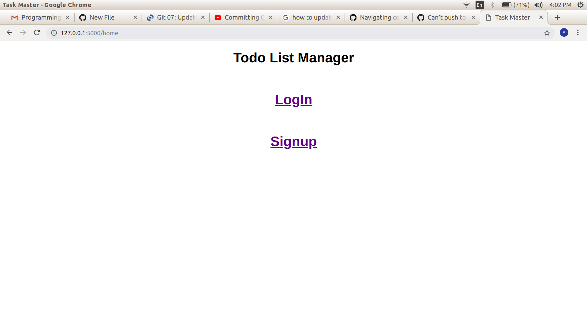
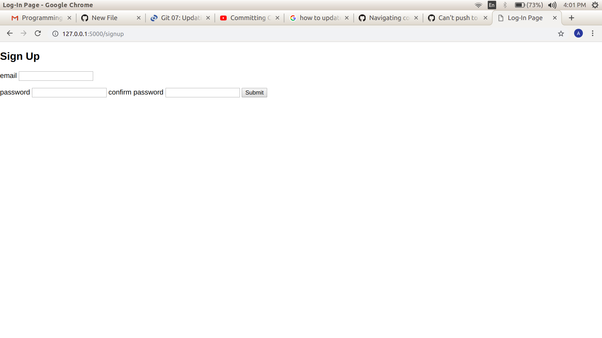
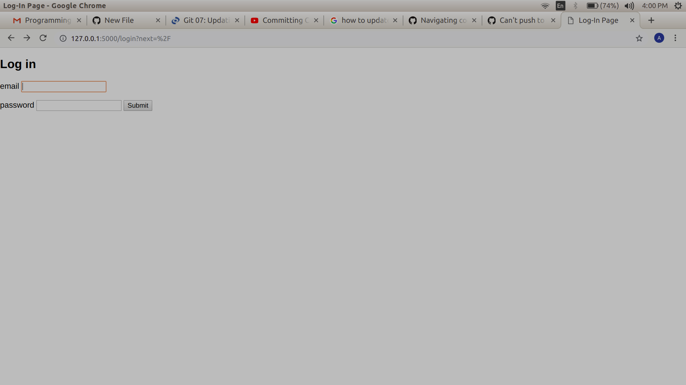
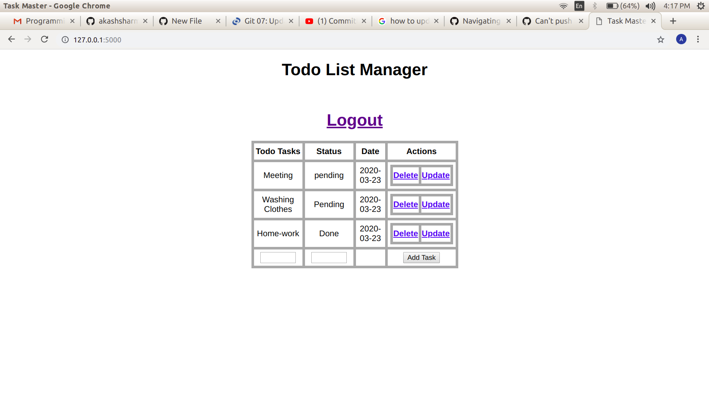

# Todolist_with_user_login-logout-signup

Host 'app.py' using terminal by typing "python3 app.py"

Now, open chrome and enter "http://127.0.0.1:5000/home" this link will direct you to home page where you will get the options to #Login and #Signup as shown image below:

Once you click signup, you will be redirected to signup page:

Once you submit your sign-up credentials, you will be redirected to the log-in page:

Once you Log-in, you get to see your list of tasks as shown below:

